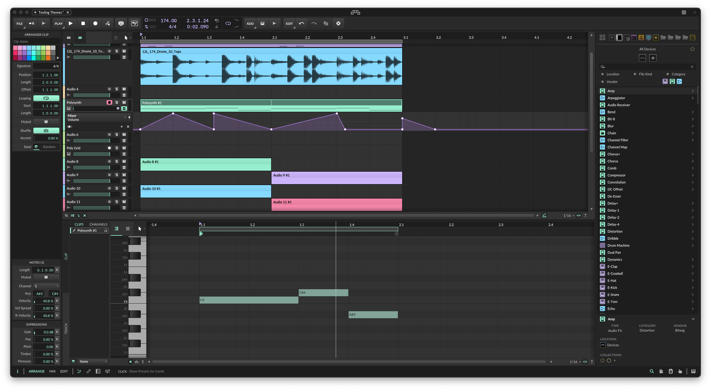
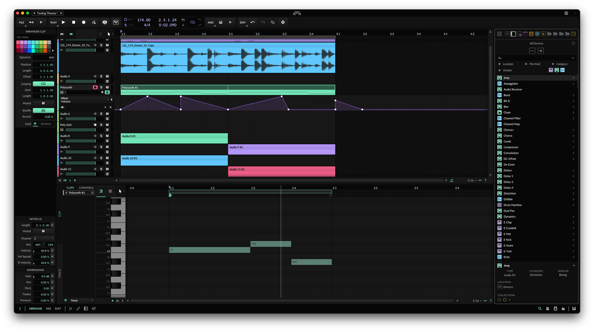
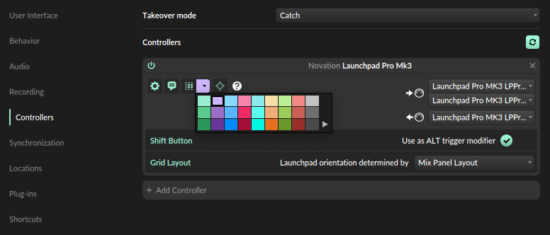

# ghosty-theme-bitwig

A dark pastel theme for use with [Berikai/bitwig-theme-editor](https://github.com/Berikai/bitwig-theme-editor)

## Ghosty Dark



## Ghosty Darker



### Instructions

Use the yaml file rather than the json as it will likely be more up to date and I'm writing descriptive comments for the values as I figure out what they do.

To get the darker version on your setup, go to Bitwig Settings > User Interface > Contrast and set Midtones = 0, Black Level = 0 and Gridlines = 100

### Extras

I've included a palette of colors to use for track/event colors in your projects. This should be placed in your Bitwig Studio directory e.g.

```
'~/Documents/Biwig Studio/Color Palettes'
```

I've also changed the color of some (but not all) of the icons used in Bitwig's browser to help tie the theme together. On MacOS these should replace some of the files in

```
'/Applications/Bitwig Studio.app/Contents/Resources/icons/browser'
```

### Tips

To get the controller highlight area to show as one of the theme colors, assign one of the included colors from the Ghosty color palette to it in Settings > Controllers



### TODO

- Not all of the colors are properly assigned, the naming of the values are pretty difficult to decipher and many are in places that I may not have thought to use yet.
  If you find an out of place color or colors that just don't look right and would like me to fix it, make an issue with a screenshot and an quick explanation of how to get there, preferably with midtones, black level and gridlines all at 50 because it makes finding the color codes much easier.
- Recolor more icons: for some reason some of the icons seem to be rendered from .svg files and others are raster images of the same icons.
- Match colors in the Grid
